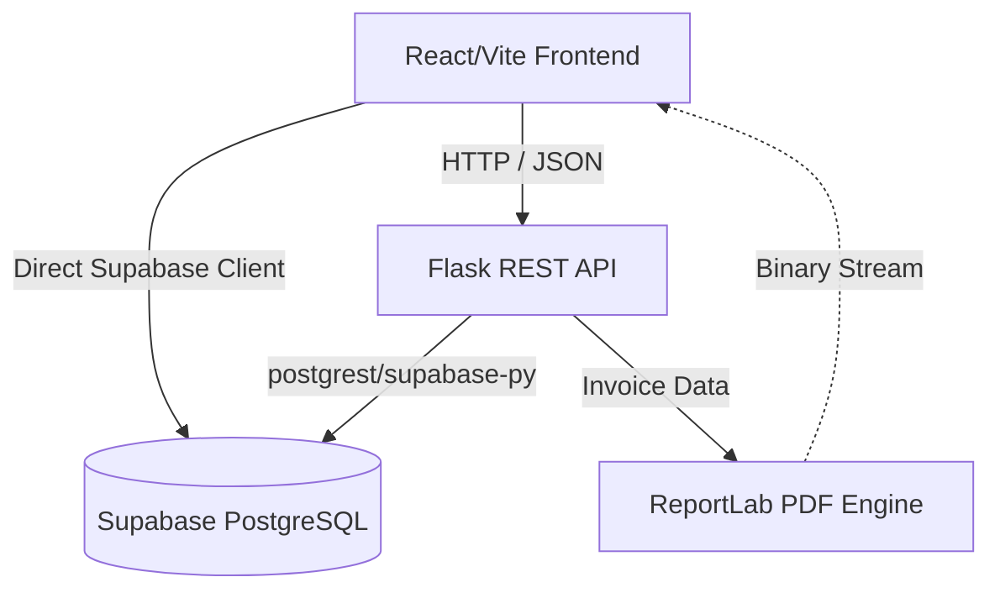

# System Architecture

UnifyMFG uses a decoupled, modern architecture designed for high throughput, data integrity, and developer velocity.

## High-Level Data Flow

## Component Breakdown

### 1. The Frontend (Vite + React)
The frontend is intentionally lightweight. It uses a custom `client.js` wrapper over the native `fetch` API to communicate with the Flask backend. 
- **Authentication**: Native Supabase JS client handles session management and JWT token injection.
- **Routing**: `react-router-dom` with protected route wrappers.

### 2. The Backend (Flask)
Flask acts as a business logic layer that enforces complex rules that cannot be easily written as PostgreSQL RLS policies.
- **Middleware**: `@require_auth` enforces that all requests have a valid JWT signed by Supabase.
- **Cost Calculation Engine**: Recursively calculates BOM (Bill of Material) costs up the chain whenever a raw material price changes.
- **Invoice Generator**: dynamically renders byte-streams of PDFs without touching the disk, using ReportLab.

### 3. The Ledger System
Instead of updating stock quantities destructively (`UPDATE products SET stock = stock - X`), UnifyMFG uses an **append-only stock ledger**.
Every inventory transaction (purchasing, manufacturing, selling) inserts a record into the `stock_ledger` table. The actual stock quantity on the product is merely a materialized view (or cached sum) of this ledger. This prevents race conditions and provides full auditability.
