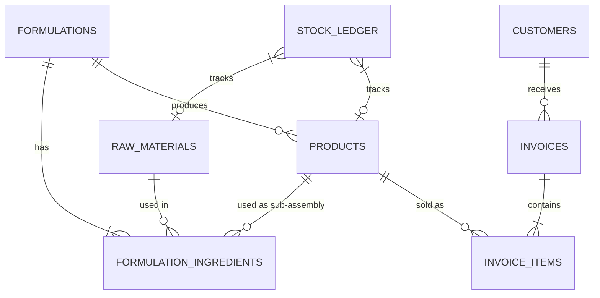

# Database Schema

UnifyMFG relies on a robust relational schema in PostgreSQL, managed by Supabase.

## Entity Relationship Diagram

## Core Tables

### `raw_materials`
Items purchased from suppliers that are consumed during production.
- **Key Fields**: `price_per_unit`, `stock_qty`, `low_stock_threshold`

### `products`
Finished goods that can be sold to customers.
- **Key Fields**: `cost_price` (calculated by backend), `wholesale_price`, `retail_price`, `formulation_id` (nullable for trading goods).
- **Packaging Fields**: `selling_unit`, `packaging_size`, `packaging_unit`.

### `formulations` & `formulation_ingredients`
The Bill of Materials (BOM) engine.
- `formulation_ingredients` utilizes an XOR constraint: an ingredient must link to either a `raw_material_id` OR a `product_id`, enabling multi-level BOMs (sub-assemblies).

### `stock_ledger`
The immutable source of truth for inventory.
- **Polymorphic tracking**: Links to either a `raw_material_id` OR a `product_id`.
- **Fields**: `change_amount` (positive or negative), `new_stock_qty`, `source` (e.g., 'production', 'sale', 'purchase').

### `invoices` & `invoice_items`
Sales tracking.
- `status`: draft, confirmed, partial, paid, cancelled.
- Handles partial payments via the `amount_paid` column.
